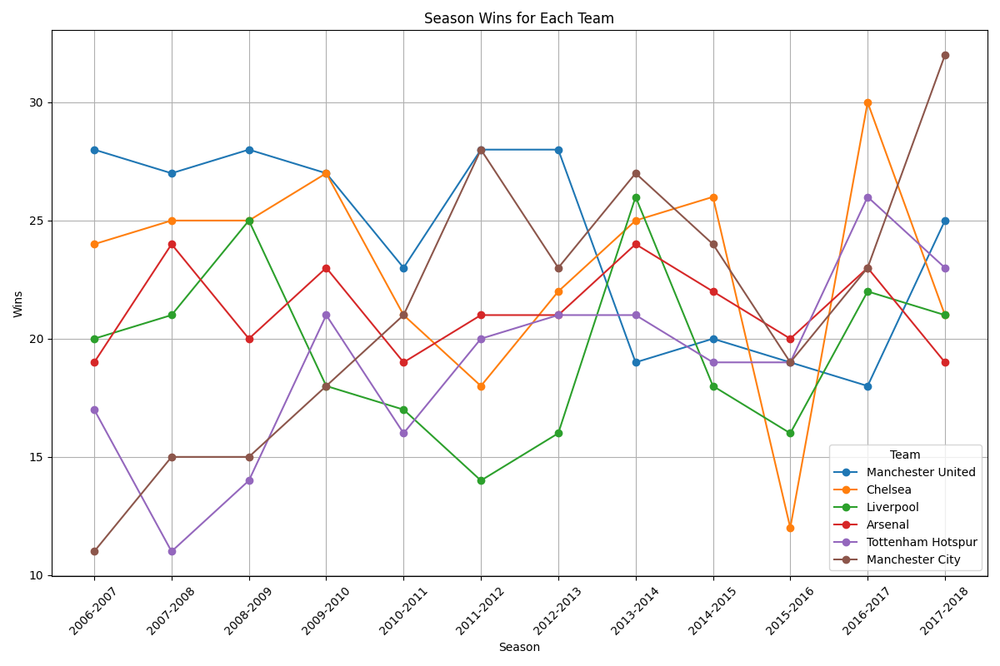
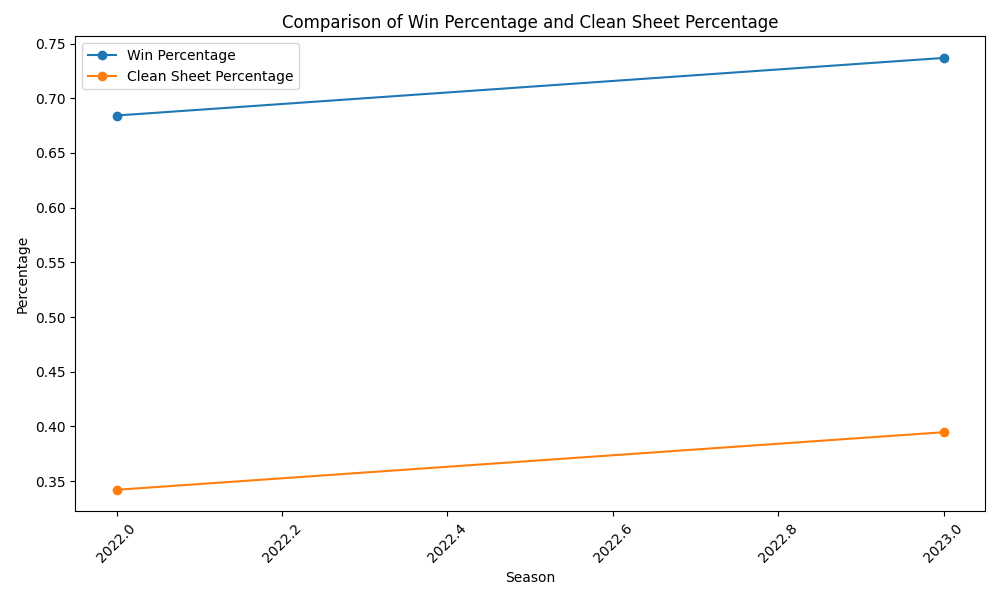

# Vishesh_Gupta_Individual_Project_1

[](https://github.com/nogibjj/Vishesh_Gupta_Individual_Project_1/actions/workflows/cicd.yml)
[](https://github.com/nogibjj/Vishesh_Gupta_Individual_Project_1/actions/workflows/format.yml)
[](https://github.com/nogibjj/Vishesh_Gupta_Individual_Project_1/actions/workflows/lint.yml)
[](https://github.com/nogibjj/Vishesh_Gupta_Individual_Project_1/actions/workflows/test.yml)

# YOUTUBE VIDEO:
[click here](https://youtu.be/fHGkFhd_ra0)

# Team Statistics Analysis

## File Structure 
```
Vishesh_Gupta_Individual_Project_1/
├── .devcontainer/
│   ├── devcontainer.json
│   └── Dockerfile
├── .github/
│   ├── workflows/cicd.yml
|   ├── workflows/format.yml
|   ├── workflows/lint.yml
|   └── workflows/test.yml
├── mylib/
|   └── help_functions.py
├── .gitignore
├── python_main_notebook.ipynb
├── python_main.py
├── Makefile
├── README.md
├── requirements.txt
├── test_lib.py
├── test_main.py
├── top_teams_wins.png
├── win_clean_sheet_relation.png
├── summary_statistics.md
└── stats.csv
```

## Overview

This project provides tools for analyzing and visualizing soccer team performance data from a CSV file. It includes functions to load data, compute basic statistics, filter top teams, calculate performance percentages, and generate plots to visualize trends.

## Features

- **Load Team Data**: Read football statistics from a CSV file.
- **Compute Basic Statistics**: Generate summary statistics for the dataset.
- **Calculate Median Values**: Get median values for specific performance metrics.
- **Filter Top Teams**: Select and display statistics for a list of top-performing teams.
- **Plot Wins**: Visualize the number of wins over different seasons for top teams.
- **Calculate Percentages**: Compute win and clean sheet percentages for a specific team.
- **Plot Percentages**: Compare win percentage and clean sheet percentage over different seasons.

## Sample Plots

### Wins Over Seasons

Here is an example plot showing wins over different seasons for top teams:



### Win and Clean Sheet Percentages

Here is a plot comparing win percentage and clean sheet percentage for a specific team:



## Functions

### `load_team_data(file_path)`

**Description:** Loads team performance data from a CSV file into a DataFrame.

**Parameters:**
- `file_path` (str): Path to the CSV file.

**Returns:** A pandas DataFrame containing the team statistics.

---

### `get_statistics(team_data)`

**Description:** Computes basic descriptive statistics for the dataset.

**Parameters:**
- `team_data` (DataFrame): DataFrame containing team statistics.

**Returns:** A DataFrame with summary statistics (count, mean, std, min, 25%, 50%, 75%, max) for numerical columns.

---

### `get_median_stats(team_data, columns)`

**Description:** Calculates the median values for specified columns.

**Parameters:**
- `team_data` (DataFrame): DataFrame containing team statistics.
- `columns` (list of str): List of column names for which to calculate medians (e.g., ["wins", "losses", "goals"]).

**Returns:** A pandas Series with median values for the specified columns.

---

### `filter_top_n_teams(team_data, top_teams_list)`

**Description:** Filters data to include only the specified top teams and selects relevant columns.

**Parameters:**
- `team_data` (DataFrame): DataFrame containing team statistics.
- `top_teams_list` (list of str): List of top team names to include in the filtered data.

**Returns:** A DataFrame containing the team, wins, and season columns for the specified top teams, with index reset.

---

### `plot_wins(top_teams_data)`

**Description:** Plots the number of wins over different seasons for each team in the filtered data.

**Parameters:**
- `top_teams_data` (DataFrame): DataFrame containing the filtered data for top teams.

**Returns:** Saves a line plot as `top_teams_wins.png`, showing the trend of wins for each team over seasons.

---

### `calculate_team_percentages(team_data, team_name, games_per_season)`

**Description:** Computes win and clean sheet percentages for a specific team.

**Parameters:**
- `team_data` (DataFrame): DataFrame containing team statistics.
- `team_name` (str): Name of the team for which to calculate percentages.
- `games_per_season` (float): Number of games played per season (e.g., 38).

**Returns:** A DataFrame containing the team’s season, wins, losses, clean sheets, calculated win percentage, and clean sheet percentage.

---

### `plot_team_percentages(team_percentages_data)`

**Description:** Plots win percentage and clean sheet percentage over seasons for a specific team.

**Parameters:**
- `team_percentages_data` (DataFrame): DataFrame containing calculated percentages for the team.

**Returns:** Saves a line plot as `win_clean_sheet_relation.png`, comparing win percentage and clean sheet percentage across seasons.

---

