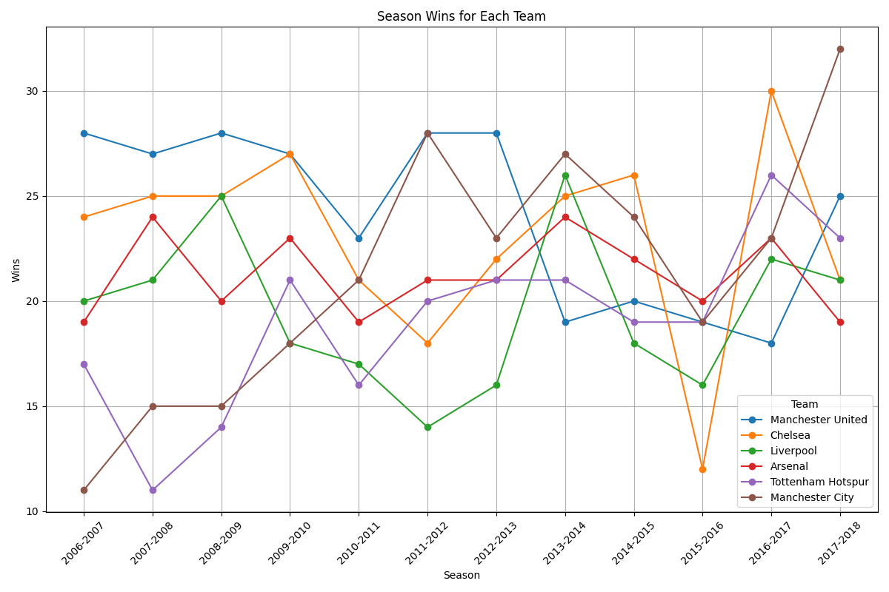

|       |     wins |   losses |   clean_sheet |   win_percentage |   clean_sheet_percentage |
|:------|---------:|---------:|--------------:|-----------------:|-------------------------:|
| count | 12       | 12       |      12       |        12        |               12         |
| mean  | 24.1667  |  6.41667 |      17.1667  |         0.635965 |                0.451754  |
| std   |  4.10838 |  2.50303 |       3.76185 |         0.108115 |                0.0989961 |
| min   | 18       |  4       |      11       |         0.473684 |                0.289474  |
| 25%   | 19.75    |  5       |      14.5     |         0.519737 |                0.381579  |
| 50%   | 26       |  5       |      17.5     |         0.684211 |                0.460526  |
| 75%   | 28       |  7.25    |      19.25    |         0.736842 |                0.506579  |
| max   | 28       | 12       |      24       |         0.736842 |                0.631579  |

